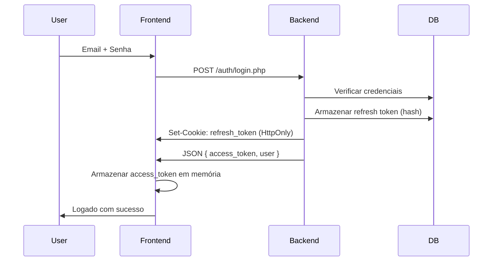
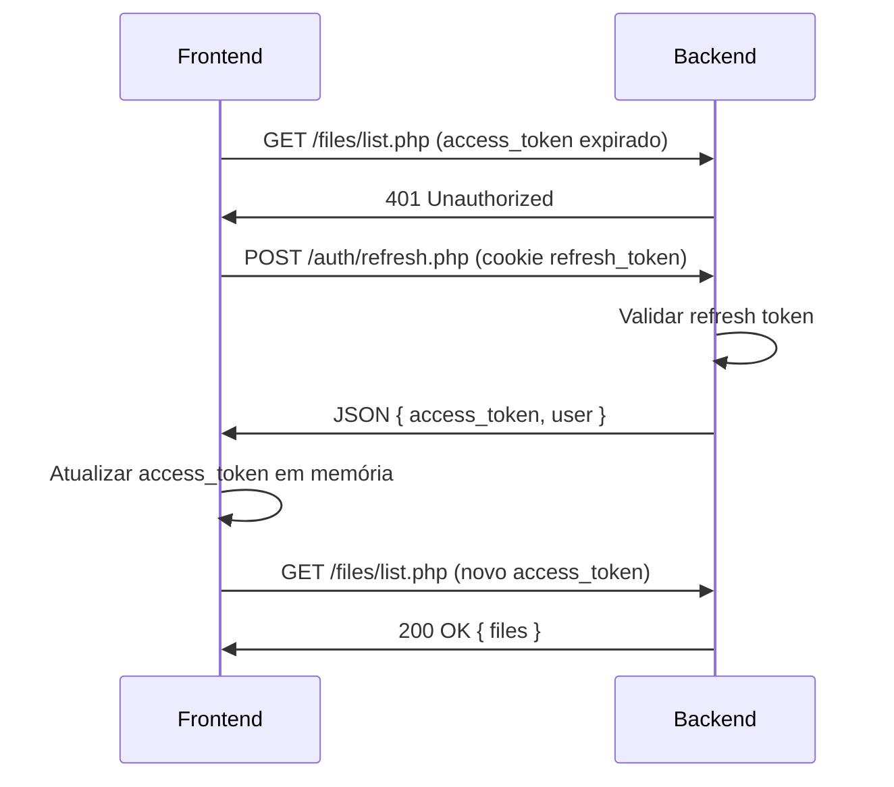
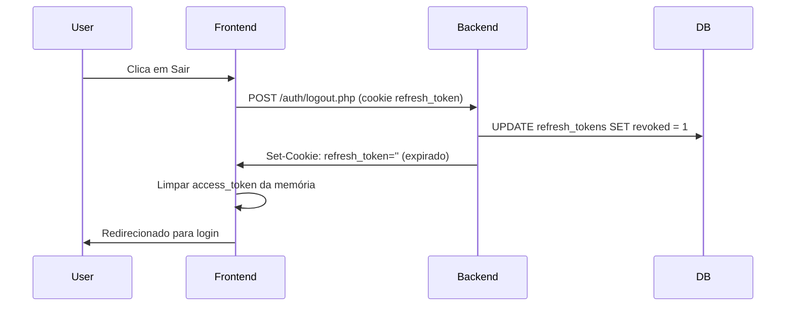

# Autenticação JWT com Cookies HttpOnly - Guia de Segurança

## ✅ Implementação Concluída

O sistema agora utiliza autenticação JWT segura com refresh tokens em cookies HttpOnly, eliminando vulnerabilidades de XSS e melhorando significativamente a segurança.

## 🔐 Arquitetura de Segurança

### Tokens em Uso

#### 1. Access Token (Curta duração - 15 minutos)
- **Localização**: Apenas em memória (variável JavaScript)
- **Duração**: 15 minutos
- **Uso**: Autenticação de requisições à API
- **Segurança**: Some ao recarregar a página, não acessível via XSS no localStorage

#### 2. Refresh Token (Longa duração - 7 dias)
- **Localização**: Cookie HttpOnly + Secure + SameSite
- **Duração**: 7 dias
- **Uso**: Renovar access token expirado
- **Segurança**: 
  - `HttpOnly`: JavaScript não consegue acessá-lo
  - `Secure`: Só enviado via HTTPS
  - `SameSite=Lax`: Proteção contra CSRF
  - Hash armazenado no banco de dados
  - Pode ser revogado no logout

---

## 📁 Arquivos Modificados/Criados

### Backend (PHP)

#### ✅ `database-refresh-tokens.sql`
Tabela para armazenar refresh tokens com segurança:
```sql
CREATE TABLE refresh_tokens (
    id INT AUTO_INCREMENT PRIMARY KEY,
    user_id VARCHAR(36) NOT NULL,
    token_hash VARCHAR(255) NOT NULL,  -- Hash SHA256 do token
    expires_at DATETIME NOT NULL,
    created_at DATETIME DEFAULT CURRENT_TIMESTAMP,
    revoked BOOLEAN DEFAULT FALSE,
    ip_address VARCHAR(45),
    user_agent TEXT,
    INDEX idx_user_id (user_id),
    INDEX idx_token_hash (token_hash)
);
```

#### ✅ `api/config/jwt.php`
- `createAccessToken()` - Cria token de 15 minutos
- `createRefreshToken()` - Gera token aleatório de 64 caracteres
- Expiration ajustada de 24h → 15 minutos

#### ✅ `api/auth/login.php`
Novo fluxo:
1. Valida credenciais
2. Cria access token (15 min)
3. Cria refresh token (7 dias)
4. Armazena hash do refresh token no banco
5. Seta refresh token em cookie HttpOnly
6. Retorna apenas access token no JSON

#### ✅ `api/auth/refresh.php` (NOVO)
Endpoint para renovar access token:
- Lê refresh token do cookie
- Valida no banco (não expirado, não revogado)
- Gera novo access token
- Retorna novo access token + dados do usuário

#### ✅ `api/auth/logout.php`
- Revoga refresh token no banco (SET revoked = 1)
- Limpa cookie HttpOnly
- Invalida sessão completamente

---

### Frontend (React + TypeScript)

#### ✅ `src/lib/api.ts`

**Mudanças principais:**

```typescript
// ❌ ANTES: token no localStorage (vulnerável a XSS)
private token: string | null = null;
constructor(baseUrl: string) {
  this.token = localStorage.getItem('access_token');
}

// ✅ AGORA: token apenas em memória
private accessToken: string | null = null;
constructor(baseUrl: string) {
  // NÃO lê localStorage
}
```

**Novo método `refreshAccessToken()`:**
```typescript
async refreshAccessToken(): Promise<string | null> {
  const response = await fetch(`${this.baseUrl}/auth/refresh.php`, {
    method: 'POST',
    credentials: 'include', // Envia cookie automaticamente
  });
  
  if (!response.ok) return null;
  
  const data = await response.json();
  this.setAccessToken(data.access_token);
  return data.access_token;
}
```

**Interceptor automático para 401:**
```typescript
async request<T>(endpoint: string, options: RequestInit = {}): Promise<T> {
  let response = await fetch(url, {
    ...options,
    credentials: 'include', // SEMPRE incluir cookies
    headers: { ...this.getHeaders(), ...options.headers },
  });

  // Se 401, tentar refresh automático
  if (response.status === 401 && !endpoint.includes('/auth/refresh')) {
    const newToken = await this.refreshAccessToken();
    if (newToken) {
      // Retry com novo token
      response = await fetch(url, { /* ... */ });
    }
  }
  
  return response.json();
}
```

#### ✅ `src/hooks/useApiAuth.tsx`

**Mudanças principais:**

```typescript
// ❌ ANTES: ler token do localStorage ao inicializar
function initAuthOnce() {
  const token = localStorage.getItem('access_token');
  const userData = localStorage.getItem('user_data');
  if (token) { authUser = JSON.parse(userData); }
}

// ✅ AGORA: tentar refresh do servidor
async function initAuthOnce() {
  const newToken = await apiClient.refreshAccessToken();
  if (newToken) {
    const user = await apiClient.getProfile();
    authUser = user as User;
  }
}
```

**Remoção completa de localStorage:**
- ❌ `localStorage.getItem('access_token')`
- ❌ `localStorage.setItem('user_data', ...)`
- ❌ `decodeJwt()` (não precisa mais decodificar no frontend)

---

## 🔄 Fluxo de Autenticação

### 1. Login


### 2. Request com Token Expirado


### 3. Logout


---

## 🛡️ Proteções Implementadas

### ✅ Contra XSS (Cross-Site Scripting)
**Problema**: Atacante injeta código JavaScript malicioso que rouba tokens do localStorage.

**Solução**:
- Refresh token em cookie `HttpOnly` → JavaScript não consegue ler
- Access token apenas em memória → Some ao recarregar página
- XSS pode roubar access token (15 min), mas não o refresh token (7 dias)

### ✅ Contra CSRF (Cross-Site Request Forgery)
**Problema**: Site malicioso força navegador a fazer requests autenticados.

**Solução**:
- Cookie com `SameSite=Lax` → Navegador só envia em requests do mesmo site
- Refresh token não funciona em requisições cross-origin

### ✅ Contra Token Replay Attack
**Problema**: Atacante reutiliza token roubado indefinidamente.

**Solução**:
- Access token expira em 15 minutos
- Refresh token pode ser revogado no banco
- Logout revoga refresh token imediatamente

### ✅ Contra Privilege Escalation
**Problema**: Usuário modifica seu role no token JWT.

**Solução**:
- Token é assinado com `JWT_SECRET`
- Backend valida assinatura em cada request
- Modificação invalida o token
- Validação periódica de role no servidor (5 min)

---

## 🚀 Como Usar

### 1. Criar Tabela de Refresh Tokens

Execute o SQL:
```bash
mysql -u root -p arquivo_manager < database-refresh-tokens.sql
```

### 2. Configurar HTTPS (Produção)

Cookie `Secure` só funciona em HTTPS. Para desenvolvimento local:
```php
// api/auth/login.php - detecção automática
$is_secure = (!empty($_SERVER['HTTPS']) && $_SERVER['HTTPS'] !== 'off') 
             || $_SERVER['SERVER_PORT'] == 443;
```

### 3. Testar no Frontend

```typescript
// Login
const { error } = await signIn('user@example.com', 'password');

// Verificar cookie no DevTools
// Application > Cookies > refresh_token (HttpOnly ✓)

// Verificar token em memória
console.log(apiClient.getAccessToken()); // "eyJhbGciOiJIUzI1NiIsInR5cCI6IkpXVCJ9..."

// Recarregar página - sessão persiste via refresh
// (Frontend chama /auth/refresh.php automaticamente)
```

---

## 📊 Comparação: Antes vs Depois

| Aspecto | ❌ Antes (localStorage) | ✅ Agora (HttpOnly Cookie) |
|---------|-------------------------|----------------------------|
| **Armazenamento do token** | localStorage (acessível via JS) | Cookie HttpOnly (inacessível via JS) |
| **Duração do token** | 24 horas | Access: 15 min, Refresh: 7 dias |
| **Vulnerável a XSS** | ✅ Sim (token roubado = acesso permanente) | ❌ Não (refresh token protegido, access token expira rápido) |
| **Vulnerável a CSRF** | ❌ Não (sem cookies) | ❌ Não (SameSite=Lax) |
| **Persiste ao recarregar** | ✅ Sim (localStorage) | ✅ Sim (refresh automático) |
| **Revogável** | ❌ Não | ✅ Sim (banco de dados) |
| **Auditoria** | ❌ Não | ✅ Sim (IP, user-agent, timestamps) |

---

## ⚙️ Configurações Avançadas

### Ajustar Duração dos Tokens

**api/config/jwt.php:**
```php
public function __construct() {
    // Produção: 5-15 minutos
    // Desenvolvimento: 30-60 minutos para facilitar testes
    $this->expiration_time = $this->issued_at + (15 * 60);
}
```

**api/auth/login.php:**
```php
// Refresh token: 7 dias padrão
$expires_at = date('Y-m-d H:i:s', time() + (7 * 24 * 60 * 60));

// Para sessões mais curtas (ex: aplicação bancária):
// $expires_at = date('Y-m-d H:i:s', time() + (1 * 24 * 60 * 60)); // 1 dia
```

### Implementar Refresh Token Rotation (Opcional)

Para segurança máxima, gerar novo refresh token a cada refresh:

**api/auth/refresh.php:**
```php
// Após validar token, gerar novo
$new_refresh_token = $jwt->createRefreshToken();
$new_token_hash = hash('sha256', $new_refresh_token);

// Revogar token antigo
$revoke_query = "UPDATE refresh_tokens SET revoked = 1 WHERE token_hash = :old_hash";
// ...

// Inserir novo token
$insert_query = "INSERT INTO refresh_tokens (user_id, token_hash, ...) VALUES (...)";
// ...

// Setar novo cookie
setcookie('refresh_token', $new_refresh_token, [...]);
```

### Limpar Tokens Expirados (Cron Job)

**cleanup-tokens.php:**
```php
<?php
include_once 'api/config/database.php';

$db = (new Database())->getConnection();
$query = "DELETE FROM refresh_tokens WHERE expires_at < NOW() OR revoked = TRUE";
$stmt = $db->prepare($query);
$stmt->execute();

echo "Deleted " . $stmt->rowCount() . " expired tokens\n";
?>
```

**Crontab (diário às 3h):**
```bash
0 3 * * * /usr/bin/php /path/to/cleanup-tokens.php
```

---

## 🧪 Testes de Segurança

### 1. Verificar Cookie HttpOnly
```javascript
// Console do navegador
document.cookie; // refresh_token NÃO deve aparecer aqui
```

### 2. Simular Token Expirado
```javascript
// Esperar 16 minutos após login
// Fazer qualquer request → deve auto-refresh transparentemente
apiClient.getFiles(); // Se funcionar, o refresh está OK
```

### 3. Testar Logout
```javascript
await signOut();
// Verificar Application > Cookies → refresh_token deve sumir
// Tentar fazer request → deve retornar 401
```

### 4. Testar Reuso de Token Revogado
```sql
-- Revogar token manualmente
UPDATE refresh_tokens SET revoked = 1 WHERE user_id = 'user-id';

-- Tentar refresh no frontend
-- Deve retornar 401 Unauthorized
```

---

## 📝 Checklist de Implementação

### Backend
- [x] Tabela `refresh_tokens` criada
- [x] `JWTHandler` atualizado (access + refresh tokens)
- [x] `login.php` seta cookie HttpOnly
- [x] `refresh.php` valida e renova tokens
- [x] `logout.php` revoga token no banco
- [x] Cookies com `Secure`, `HttpOnly`, `SameSite`

### Frontend
- [x] Removido todo uso de `localStorage` para tokens
- [x] Access token apenas em memória
- [x] `refreshAccessToken()` implementado
- [x] Interceptor 401 → auto-refresh → retry
- [x] `credentials: 'include'` em todas as requests
- [x] Inicialização via `/auth/refresh.php`

### Segurança
- [x] XSS não consegue acessar refresh token
- [x] CSRF protegido por SameSite
- [x] Tokens têm duração limitada
- [x] Logout revoga refresh token
- [x] Logs de segurança (IP, user-agent)

---

## 🚨 Troubleshooting

### Problema: Cookie não está sendo setado
**Causa**: HTTPS não configurado em produção.

**Solução**:
```php
// Temporário para testes (REMOVER EM PRODUÇÃO!)
'secure' => false, // Permite HTTP
```

### Problema: 401 constante mesmo após login
**Causa**: `credentials: 'include'` faltando nas requests.

**Solução**: Verificar que todas as chamadas `fetch()` têm:
```typescript
fetch(url, {
  credentials: 'include', // ← Obrigatório
  // ...
});
```

### Problema: Sessão não persiste ao recarregar
**Causa**: Frontend não está chamando `/auth/refresh.php` na inicialização.

**Solução**: Verificar `initAuthOnce()` em `useApiAuth.tsx`:
```typescript
async function initAuthOnce() {
  const newToken = await apiClient.refreshAccessToken(); // ← Deve ser chamado
  // ...
}
```

---

## 📚 Referências

- [OWASP JWT Security Cheat Sheet](https://cheatsheetseries.owasp.org/cheatsheets/JSON_Web_Token_for_Java_Cheat_Sheet.html)
- [RFC 6749 - OAuth 2.0 (Refresh Tokens)](https://datatracker.ietf.org/doc/html/rfc6749#section-1.5)
- [MDN: Set-Cookie (HttpOnly, Secure, SameSite)](https://developer.mozilla.org/en-US/docs/Web/HTTP/Headers/Set-Cookie)

---

## 🎯 Próximos Passos (Opcional)

1. **Refresh Token Rotation**: Gerar novo refresh token a cada renovação
2. **Device Tracking**: Armazenar dispositivos ativos por usuário
3. **Multiple Sessions**: Permitir múltiplos dispositivos logados simultaneamente
4. **Suspicious Activity Detection**: Detectar mudanças de IP/user-agent suspeitas
5. **Two-Factor Authentication (2FA)**: Adicionar segunda camada de autenticação
